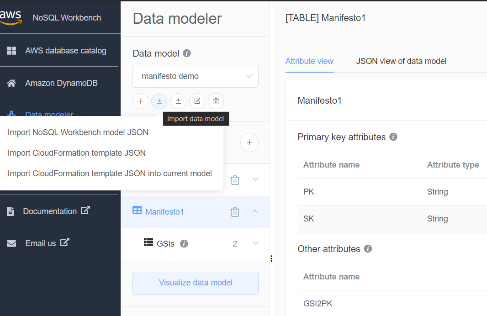

# Manifest Database README

## NoSQL Workbench

| Operating | System |
| ------ | ------ |
| macOS | [Download for macOS](https://s3.amazonaws.com/nosql-workbench/NoSQL%20Workbench-mac-3.3.0.dmg) |
| Windows | [Download for Windows](https://s3.amazonaws.com/nosql-workbench/NoSQL%20Workbench-win-3.3.0.exe) |
| Linux | [Download for Windows](https://s3.amazonaws.com/nosql-workbench/NoSQL%20Workbench-linux-x86_64-3.3.0.AppImage) |

[Download demo of database workbench JSON](files/manifesto-demo.json)

### Importing the workbench model into personal NoSQL Workbench:

Select: Import NoSQL Workbench model JSON

In the Workbench Visualizer, you can see the mock database and look at the different Indices on the table

## Lambdas

### Importing boto3
```sh
import boto3
from boto3.dynamodb.conditions import Key
```

### Querying with boto3 general form
```sh
response = table.query(
        IndexName = ' { INDEX NAME } ', # Not needed if index is default
        KeyConditionExpression=Key('{ KEY NAME }').{ Attribute Base Function }(' { ITEM } ') & Key('{ KEY NAME }').{ Attribute Base Function  }(' { ITEM } ')
)
```

### boto3.dynamodb.conditions
```sh
class ConditionBase:

  def eq(self, value):
          """Creates a condition where the attribute is equal to the value.

          :param value: The value that the attribute is equal to.
          """
          return Equals(self, value)


  def begins_with(self, value):
        """Creates a condition where the attribute begins with the value.

        :param value: The value that the attribute begins with.
        """
        return BeginsWith(self, value)
        
  def between(self, low_value, high_value):
        """Creates a condition where the attribute is greater than or equal
        to the low value and less than or equal to the high value.

        :param low_value: The value that the attribute is greater than or equal to.
        :param high_value: The value that the attribute is less than or equal to.
        """
        return Between(self, low_value, high_value)  
        
```

| USE CASES | IndexName | KeyConditionExpression |
| ------ | ------ | ------ |
| GET ARTICLE 1 | DEFUALT | ``` Key('PK').eq('ARTICLE#1') & Key('SK').eq('ARTICLE#1') ``` |
| GET ARTICLE 1 STATS | DEFUALT | ``` Key('PK').eq('ARTICLE#1') & Key('SK').eq('ARTICLE#1#STATS') ``` |
| LIST ARTICLE 1 COMMENTS  | DEFUALT | ``` Key('PK').eq('ARTICLE#1') & Key('SK').begins_with('COMMENT') ``` |
| GET ARTICLE 1 READERS  | DEFUALT | ``` Key('PK').eq('ARTICLE#1') & Key('SK').begins_with('READ') ``` |
| GET ARTICLE 1 PREVIOUS UPDATES | DEFUALT | ``` Key('PK').eq('ARTICLE#1') & Key('SK').begins_with('UPDATED') ``` |
| GET USER 1 INFO  | DEFUALT | ``` Key('PK').eq('USER#1') & Key('SK').begins_with('DEPARTMENT') ``` |
| LIST USERS IN DEPARTMENT ENGINEERING | GSI1 | ``` Key('SK').eq('DEPARTMENT#ENGINEERING') & Key('PK').begins_with('') ``` |
| GET USER 1 WEEKLY STATS | DEFUALT | ``` Key('PK').eq('USER#1') & Key('SK').eq('USER#1#WEEKLYSTATS') ``` |
| GET USER 1 MONTHLY STATS | DEFUALT | ``` Key('PK').eq('USER#1') & Key('SK').eq('USER#1#MONTHLYSTATS') ``` |
| GET USER 1 FAVORITES | DEFUALT | ``` Key('PK').eq('USER#1') & Key('SK').eq('USER#1#FAVORITES') ``` |
| LIST ARTICLES READ BY USER 1 | DEFUALT | ``` Key('PK').eq('USER#1') & Key('SK').begins_with('USER#1#ARTICLE') ``` |
| LIST ARTICLES READ BY USER 1 (ALT) | GSI2 | ``` Key('GSI2PK').eq('USER#1') & Key('SK').begins_with('READ') ``` |
| LIST COMMENTS BY USER 1 | GSI2 | ``` Key('GSI2PK').eq('USER#1') & Key('SK').begins_with('COMMENT') ``` |
| LIST ASSIGNED READING FOR USER 1 | DEFUALT | ``` Key('PK').eq('USER#1') & Key('SK').begins_with('USER#1#ASSIGNED') ``` |
| GET IF USER VISITED ASSIGNED READING ARTICLE 1 FOR USER 1 | DEFUALT | ``` Key('PK').eq('USER#1') & Key('SK').eq('USER#1#ASSIGNED#ARTICLE#1') ``` |
| GET ARTICLES READ HISTORY | DEFUALT | ``` Key('PK').eq('USER#1') & Key('SK').eq('USER#1#HISTORY') ``` |
| UPDATE USER 1 STREAK | DEFUALT | ``` Key('PK').eq('USER#1') & Key('SK').begins_with('READARTICLE#{ day before's date }') ``` |
| GET ARTICLES VISITED ON PREVIOUS DATE FOR SPECIFIC USER | DEFUALT | ``` Key('PK').eq('USER#1') & Key('SK').begins_with('READARTICLE#{ date }') ``` |
| LIST READINGLIST | GSI2 | ``` Key('GSI2PK').eq('READINGLIST') & Key('SK').begins_with('READINGLIST') ``` |
| GET READINGLIST 1 | DEFAULT | ``` Key('PK').eq('READINGLIST#1') & Key('SK').eq('READINGLIST#1') ``` |
| LIST ATRICLES IN READINGLIST 1 | DEFAULT | ``` Key('PK').eq('READINGLIST#1') & Key('SK').begins_with('ARTICLES') ``` |
| GET READINGLIST 1 STATS | DEFAULT | ``` Key('PK').eq('READINGLIST#1') & Key('SK').eq('READINGLIST#1#STATS') ``` |
| GET ARTICLES OF TAG | GSI1 | ``` Key('SK').eq('TAG#{ tag_name }') & Key('PK').eq('#1#STATS') ``` |


